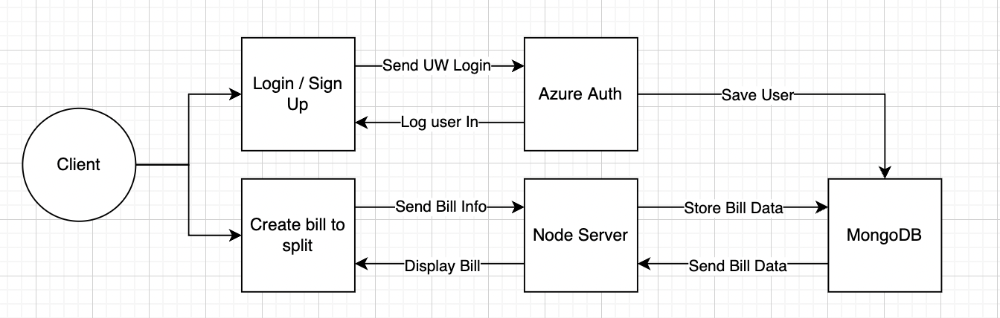

# DivvyUp
Project Members: Ian Wang, Mark Zhang, Jason Nguyen, Yash Katwal

## Project Description
DivvyUp is a spending management application focused towards making splitting purchases among groups of individuals easier. Users will be able to add to a joint spending list and thereafter split the cost of the purchase by each individual.

DivvyUp will be used in settings where there is one person making a purchase for a group of people. Prior to a purchase, individuals can add items to a joint purchase list. Users added in the shopping trip can choose what they wish to pay for within the joint purchase list and add their names to items. At the end of the trip, the person handling the transaction will input the total price for each item. The application will then calculate the subtotal cost for each person in the shopping trip. This allows the one person making the purchases to easily calculate the subtotal and charge others. 

People living along with others will easily benefit from using this application because oftentimes the payment for grocery trips are made by one person. Not everyone will necessarily want every item that is bought. After a shopping trip, it is hard to keep track of who “bought” what. Currently there are not any apps that are designed for this use case. This app aims to streamline the process of group purchases. 

We as developers want to build this application because as students we often deal with the struggle of splitting costs after group purchases. The process is tedious and time consuming and we find that many of our peers encounter the same problem. Therefore, we wanted to build this app to help alleviate this issue. 

## Technical Description

#### Infrastructure

#### Feature Priorities
| Priority | User | Description | Technical Implementation |
|---|---|---|---|
| P0 | As the primary purchaser | I want to create a shopping trip session | Have a post request that creates a new table in the database which houses users and a new shopping list for the group of users |
| P0 | As a joint purchaser | I want to join a shopping trip session | Have some sort of logic that puts the join purchaser into the shopping session if both the primary and join purchaser agree |
| P1 | As a joint purchaser | I want to be able to add/remove items into the shopping list | Have a post and delete request to allow all users in a group to freely add and remove items from the shopping list |
| P2 | As a joint purchaser | I want to be able to add myself to a item on the shopping list | For the shopping list, have some fields which holds users to exclude users who will not use the item from the final bill | 
| P3 | As the primary purchaser | I want to be able to input costs of items | Have a post request that allows the user to change the price of the items on the shopping list | 
| P4 | As the primary  purchaser | I want to be able to get the subtotal for each joint purchaser | Have a get request which displays information on the bill |
| P5 | As the primary purchaser | I want to be able to charge each joint purchaser by their calculated subtotal via online payment | Have some system which automatically sends a payment request with the appropriate amount. |

## API Endpoints
 
#### Authentication
* `/signin`
   * Handle user sign in through Azure
* `/signout`
   * Delete the current user session and sign out
* `/error`
   * Handle login and general server errors
* `/unauthorized`
   * Deny access if login is not made with UW NetID Account
 
#### Users: /v1/users/
* GET
   * `/name`
       * Returns name of user
   * `/primary`
       * Returns boolean whether user is a primary purchaser (otherwise joint)
   * `/items/user (param:?user=)`
       * return all items purchased from the current user
* POST
   * `/add `
       * Add a new user to the database and redirect to home page
   * `/additem`
       * Add a grocery item to the current user
* DELETE
    * `/delete`
       * Delete an existing user from the shopping list and redirect to home page
    * `/removeitem`
       * Remove a grocery item from the current user’s shopping list
 
#### Trip: /v1/trip/
* GET
   * `/users`
       * Return all user IDs in the user group
* POST
   * `/add (param?temp=bool)`
       * Add a new user group to the database
   * `/join (param?user=)`
       * Add the specified user to the user group in the database
* DELETE
   * `/remove`
       * Remove group in the database   
   * `/leave`
       * Remove the specified user from the user group in the database
      
#### Purchasers: /v1/purchasers/
* POST
   * `/uploadprice`
       * Update price for items in shopping list in the database
* DELETE
    * `/removeitem `
       * Removes grocery item if item is unavailable
 
#### Receipt: /v1/receipt/
* GET
   * `/price`
       * Get price for every item in shopping list in the database
   * `/items`
       * Return all items on the joint shopping list
 
#### Item: /v1/item (param)
* GET
   * `/`
       * Get information on the selected grocery item
 
#### Payment Api
* Options
   * https://github.com/mmohades/VenmoApiDocumentation
   * More

