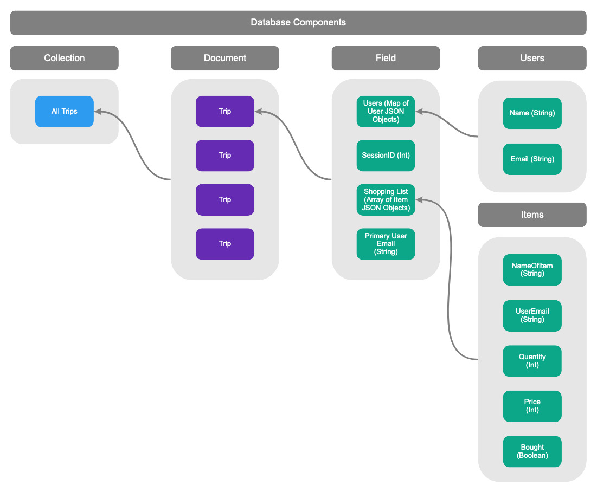

# DivvyUp
Project Members: Ian Wang, Mark Zhang, Jason Nguyen, Yash Katwal

## Project Description
DivvyUp is a spending management application focused on making splitting purchases among groups of people easier. Users will be able to add to a joint spending list and thereafter split the cost of the purchase by each individual.

DivvyUp will be used in settings where there is one person making a purchase for a group of people. Prior to purchase, individuals can add items to a joint purchase list. Users added to the shopping trip can choose what they wish to pay for within the joint purchase list and add their names to items. At the end of the trip, the person handling the transaction will input the total price for each item. The application will then calculate the subtotal cost for each person on the shopping trip. This allows the one person making the purchases to easily calculate the subtotal and charge others.

People living along with others will easily benefit from using this application because oftentimes the payment for grocery trips is made by one person. Not everyone will necessarily want every item that is bought. After a shopping trip, it is hard to keep track of who “bought” what. Currently, existing solutions like Venmo, split pay, etc rely on the user to manually calculate the cost of splitting bills. This app aims to automate this process.

We as developers want to build this application because as students we often deal with the struggle of splitting costs after group purchases. The process is tedious and time-consuming and we find that many of our peers encounter the same problem. Therefore, we wanted to build this app to help alleviate this issue for ourselves and for others.

## Technical Description

### Infrastructure
#### Architecture Diagram

#### Database Components

#### Feature Priorities
| Priority | User | Description | Technical Implementation |
|---|---|---|---|
| P0 | As the primary purchaser | I want to create a shopping trip session | Include a post request that creates a new table in the database which houses users and a new shopping list for the group of users |
| P0 | As a joint purchaser | I want to join/accept a shopping trip session | Use a post request that allows a joint purchaser into the shopping session if both the primary and join purchaser agree. |
| P0 | As a joint purchaser | I want to be able to add items into the shopping list | Include a post request to allow all users in a group to freely add items from the shopping list and send data to client. |
| P0 | As a joint purchaser | I want to be able to add myself to an item on the shopping list | For the shopping list, have some fields which holds users to exclude users who will not use the item from the final bill |
| P0 | As the primary purchaser | I want to be able to input the costs of items | Include a post request that allows the user to change the price of the items on the shopping list |
| P1 | As a joint purchaser | I want to be able to remove items from the shopping list | Include a delete request to allow all users in a group to remove items from the shopping list.|
| P1 | As a joint purchaser | I want to be able to remove myself from a shopping trip session | Include a delete request that will allow a joint purchaser to leave the shopping trip session |
| P2 | As the joint purchaser | I want to know how much money I have to pay | Include a get request which displays information on the bill |
| P3 | As the primary purchaser | I want to be able to charge each joint purchaser by their calculated subtotal via online payment | Call API of payment system automatically sends a payment request with the appropriate amount. |

## API Endpoints

#### Authentication
* `/signin`
   * Handle user sign in through Azure
* `/signout`
   * Delete the current user session and sign out
* `/error`
   * Handle login and general server errors
* `/unauthorized`
   * Deny access if login is not made with UW NetID Account
 
#### Trips: trips/
* GET
    * `/tripID`
        * Returns the Session (trip) ID for the current trip

    * `/subtotal`
        * Returns the subtotal of all items in the current trip

    * `/userStatus`
        * Returns the Authentication status of the user
* POST
    * `/add`
        * Add a new trip to the database

    * `/add?{User Email}`
        * Add a specified user to the shopping trip
* DELETE
    * `/delete`
        * Removes a trip from the database

#### Users: users/
* GET
    * `/users`
        * Gets user session info

#### Items: items/
* GET
    * `/receipt`
        * Returns the entire shopping list
    * `/bought`
        * Returns whether an item was bought
* POST
    * `/add?{Quantity}`
        * Adds item to the current trip's shopping list
    * `addPrice`
        * Adds price for items or report unavailable in shopping list in the database

* DELETE
     * `/delete`
        * Deletes item from database

#### Payment Api
* Options
   * https://github.com/mmohades/VenmoApiDocumentation
   * More
